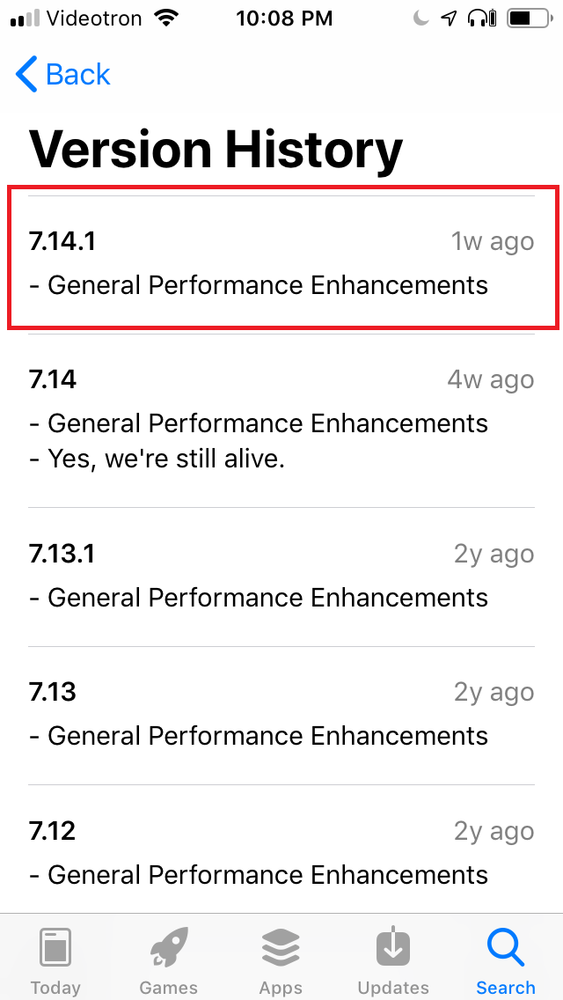

# BlueDriver Diagnostics Tool - Crash Report Information

This repository was created to share some files with the BlueDriver support team regarding some issues Im getting with the application and the tool.

## crashes and spins

This folder was extracted from a SysDiagnose packages that was dumped from my iPhone. Since the SysDiagnose package contains a lot of information that are not relevant to this crash, I just commited those crashes dumps.

 - [BlueDriver-2024-10-28-220555.txt](BlueDriver-2024-10-28-220555.txt)
 - [BlueDriver-2024-10-28-220048.ips](crashes_and_spins/BlueDriver-2024-10-28-220048.ips)
 - [BlueDriver-2024-10-28-215952.ips](crashes_and_spins/BlueDriver-2024-10-28-215952.ips)
 - [BlueDriver-2024-10-28-220555.ips](crashes_and_spins/BlueDriver-2024-10-28-220555.ips)
 - [BlueDriver-2024-10-28-220555.ips](crashes_and_spins/BlueDriver-2024-10-28-220555.ips)
 - [Analytics-2024-10-28-201829.ips.ca.synced](crashes_and_spins/Analytics-2024-10-28-201829.ips.ca.synced)
 - [Analytics-Journal-2024-10-28-201830.ips.ca.synced](crashes_and_spins/Analytics-Journal-2024-10-28-201830.ips.ca.synced)
 - [stacks-2024-10-28-222433.ips](crashes_and_spins/stacks-2024-10-28-222433.ips)

## movies

Here's some captured movies of the crash

**First**

**Second**

## Screenshots

#### Phone Information 1

#### Phone Information 2

#### Phone Information 3

#### App

#### App Versions

